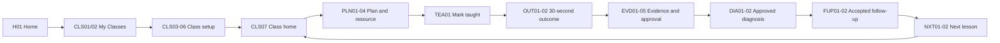
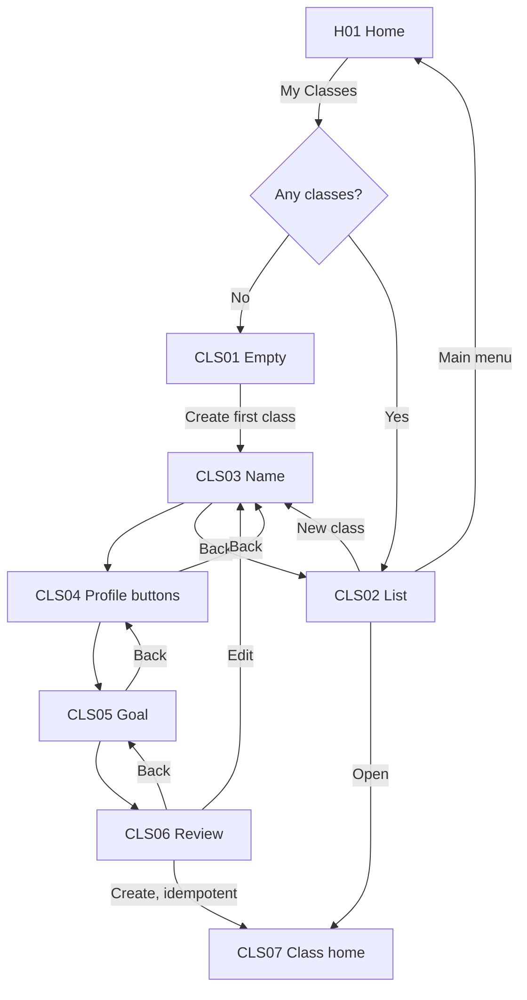
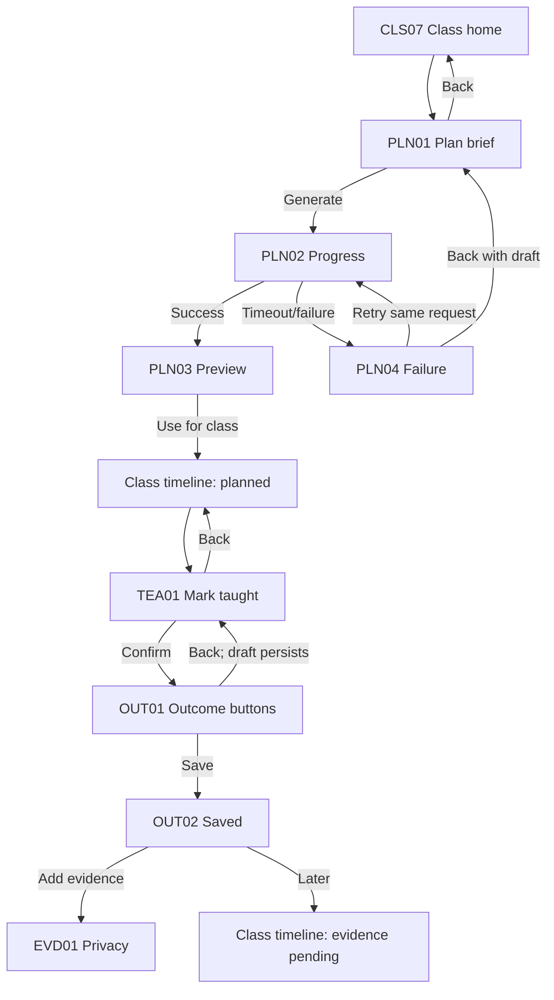
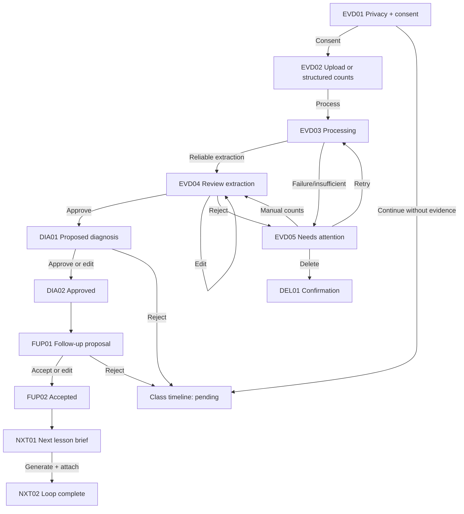
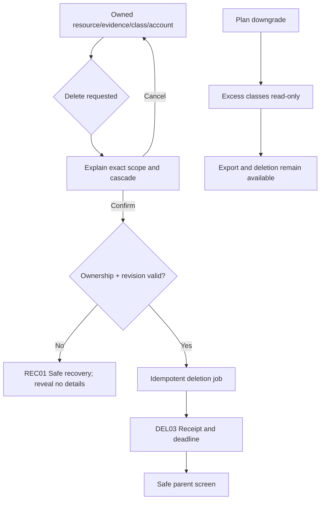
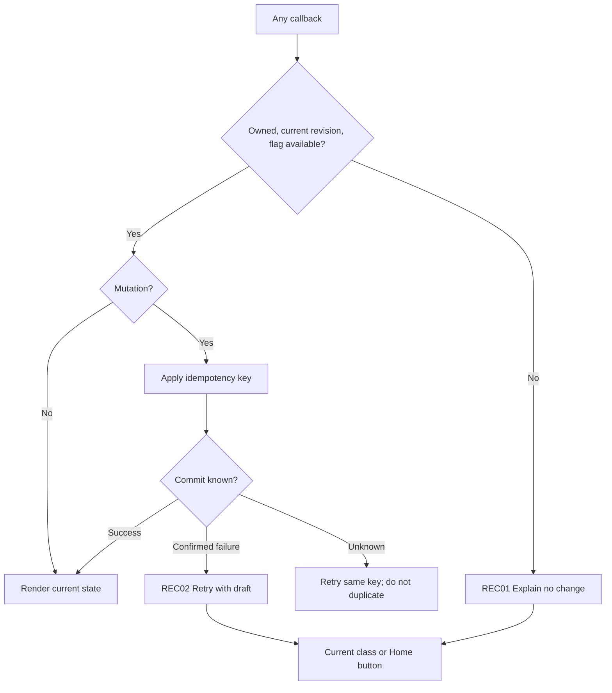

# TeacherOS Day 3 Telegram Wireflow

Status: **draft for comprehension testing**. This is a product contract, not an implemented UI.

## Flagship loop

The only north-star completion edge is `NXT01 → NXT02`: the accepted follow-up is attached to a saved next resource and `loop_completed` is emitted once. Every earlier step is funnel progress, not completed value.

## Entry and class setup

Telegram displays one short input at a time. The teacher never enters student names. Button groups capture level, learner-count band, cadence, and goal; a short private class label and optional note are the only free text. Saved context is editable at review.

## Plan, teach, and outcome

Export or download does not mark a lesson taught. The outcome uses bounded buttons and a review step; it is not a narrative report.

## Evidence, diagnosis, and teacher control

Evidence is optional and requires separate consent. Upload is not approval. Extraction is not diagnosis. Diagnosis is a proposal until the teacher approves it. Rejection has no hidden mutation.

## Deletion and downgrade

Raw evidence is purged immediately after confirmation. Class metadata may have a seven-day soft-delete window, but raw evidence cannot be restored. Downgrade is never deletion.

## Universal retry and stale-state recovery

No recovery message tells the teacher to type `/start`. A visible inline Home action always exists.

## Screen completeness checklist

The machine-readable screen catalog contains 33 contracted states across entry, setup, plan, teach, outcome, evidence, diagnosis, follow-up, next lesson, shared data controls, deletion, and recovery. Every record defines:

- primary action;
- Back/escape route;
- empty behavior;
- retry behavior;
- confirmation behavior;
- recovery behavior;
- compact callback examples.

Run `python backend/day3_contract_check.py` to verify completeness, callback grammar, event metadata, flags, deletion rules, and the unresolved approval gates.
